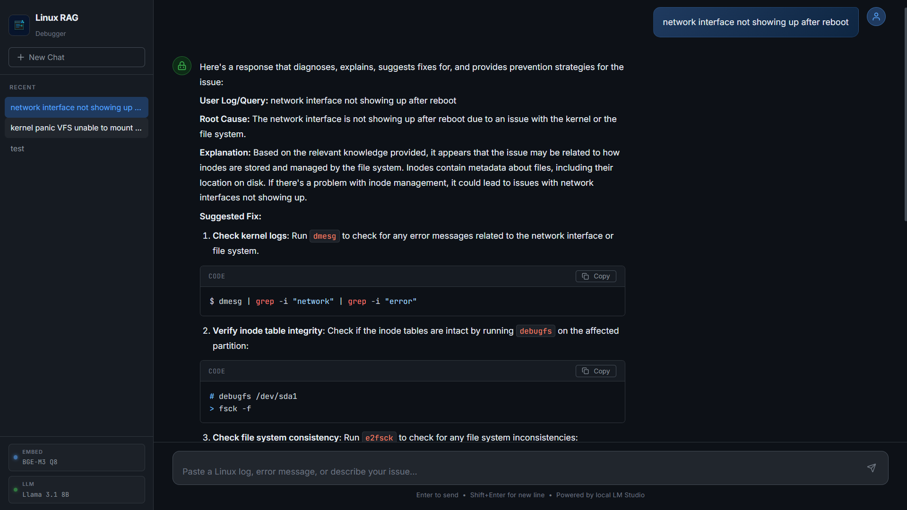

<div align="center">
  

  <h1>LinuxLynx</h1>
  <p><strong>Local RAG-powered Linux log diagnosis and troubleshooting assistant</strong></p>

  <p>
    
    
    
    
    
  </p>

  
</div>

---

## Overview

**LinuxLynx** is a fully local Retrieval-Augmented Generation (RAG) system built to diagnose Linux system errors, parse logs, and recommend fixes. It combines a structured knowledge base scraped from Stack Exchange, GitHub Issues, and Arch Wiki with a local embedding model and LLM — requiring **no cloud API calls at query time**.

```
User Query → BGE-M3 Embed → ChromaDB Search → Context + Prompt → Llama 3.1 8B → Streamed Answer
```

---

## Architecture

```
data/
├── training/          # Raw scraped JSONL (StackExchange, GitHub, Web)
├── processed/         # LLM-formatted structured documents (Gemini/Groq)
├── processed_normal/  # Heuristically formatted documents (no LLM)
└── vectordb/          # ChromaDB persistent vector store (not committed)

src/
├── scrapers/          # Data collection (StackExchange, GitHub, Arch Wiki)
├── ingest.py          # Document loader + JSONL parser
├── clean.py           # Text normalization
├── chunk.py           # Sliding window chunker (4000 char chunks)
├── embed.py           # LM Studio embedding client (BGE-M3)
├── vector_store.py    # ChromaDB wrapper
├── retrieve.py        # Semantic retriever
├── rag.py             # RAG orchestrator
└── llm_client.py      # LM Studio / Ollama / OpenAI LLM client

app.py                 # Flask web server (SSE streaming)
templates/index.html   # Chat frontend
static/                # CSS, JS, logo, interface screenshot
```

---

## Data Pipeline

### 1. Scraping

Three data sources were scraped using API wrappers:

| Source | Tool | Volume |
|---|---|---|
| Stack Exchange (Linux/Unix/Ask Ubuntu) | `stackapi` | ~9,500 Q&A pairs |
| GitHub Issues (systemd, linux kernel repos) | `PyGithub` | ~950 issues |
| Arch Wiki + Man pages | `BeautifulSoup4` | ~950 articles |

```bash
python main.py extract-all --output-dir data/training
```

Raw data is stored as `.jsonl` files in `data/training/` with a persistent content-hash deduplication layer (`src/dedup.py`) to prevent re-scraping already seen documents.

### 2. Structured Formatting (Extraction)

Raw scraped text was converted into a structured RAG schema:

```json
{
  "doc_id": "github_issue_1234",
  "domain": "networking",
  "hardware_env": "kernel, systemd, debian",
  "problem": "daemon-reload triggers an assertion in manager_unref_uid_internal()",
  "raw_logs": "...(stack trace)...",
  "solution": "Upgrade systemd to version 243-2"
}
```

**Three formatters were built, tried in order:**

#### `src/local_formatter.py` — LM Studio (Meta-Llama 3.1, local)
Used initially for highest quality extraction via a local LLM running in LM Studio. Discarded for bulk processing due to **speed** — extracting 10,000+ documents locally took too long.

#### `src/groq_formatter.py` / `src/gemini_formatter.py` — API LLMs
Migrated to Groq (Llama 3.3 70B) and Gemini Flash for cloud-accelerated extraction. Both were ultimately **rate-limited** aggressively:
- Groq: Tokens Per Minute (TPM) limits caused repeated 429s even at 3 RPM
- Gemini: Daily quota exhausted quickly on large documents

Both formatters use async map-reduce chunking with retry/backoff logic.

#### `src/normal_formatter.py` — Heuristic (No LLM) ✅ Final Choice
A deterministic regex + structural heuristic extractor that requires **zero API calls**. It identifies problem/solution boundaries by structural signals (last code block = logs, final paragraph = solution). All 8,514 training documents were successfully processed in minutes.

```bash
python src/normal_formatter.py --directory data/training --output data/processed_normal
```

### 3. Embedding

Documents are chunked (4,000 chars, 400 char overlap) and embedded using **BAAI/bge-m3** — chosen for:
- **8,192 token context window** (handles full kernel panics / stack traces)
- **Hybrid dense+sparse retrieval** capability
- 1,024-dimensional vectors

Embeddings are generated via **LM Studio's local OpenAI-compatible API** — no Python model download required.

```bash
python main.py ingest --type jsonl --source data/processed_normal
```

Vectors are stored in **ChromaDB** at `data/vectordb/` (excluded from git).

---

## Setup

### Prerequisites

- Python 3.10+
- [LM Studio](https://lmstudio.ai/) installed

### 1. Clone & Install

```bash
git clone https://github.com/your-username/LinuxLynx.git
cd LinuxLynx
python -m venv venv
venv\Scripts\activate        # Windows
# source venv/bin/activate   # Linux/macOS
pip install -r requirements.txt
```

### 2. Environment Variables

Copy `.env` and fill in any API keys needed for scraping (not required if using pre-processed data):

```env
STACK_API_KEY=your_key
GITHUB_ACCESS_TOKEN=your_token

# LM Studio (local server — no key needed)
LM_STUDIO_BASE_URL=http://localhost:1234/v1
LM_STUDIO_EMBED_MODEL=ggml-org/bge-m3-Q8_0-GGUF
LM_STUDIO_CHAT_MODEL=bartowski/Meta-Llama-3.1-8B-Instruct-GGUF/Meta-Llama-3.1-8B-Instruct-Q6_K_L.gguf
```

### 3. LM Studio Setup

> This is required before running any embedding or querying step.

1. Download and open **[LM Studio](https://lmstudio.ai/)**
2. Search and download these two models:
   - **Embed:** `ggml-org/bge-m3-Q8_0-GGUF` (2.2 GB)
   - **Chat:** `bartowski/Meta-Llama-3.1-8B-Instruct-Q6_K_L` (6.6 GB)
3. Go to the **Developer** tab (`</>` icon in sidebar)
4. Load **both** models
5. Click **Start Server** — it should show `Running on http://localhost:1234`

### 4. Build the Vector Database

```bash
python main.py ingest --type jsonl --source data/processed_normal
```

This will embed all 8,514 documents (~9,250 chunks). Takes 15–30 minutes depending on your GPU.

### 5. Run the Web App

```bash
python app.py
```

Open **[http://localhost:5000](http://localhost:5000)** in your browser.

---

## Usage

### Web Interface

The web app provides a streaming chat interface. Type or paste any Linux error, log snippet, or question. Responses stream in real-time token by token.

**Query examples:**
```
systemd Failed to mount tmp.mount: Operation not permitted
Out of memory: Kill process 1842 (mysqld) score 847 or sacrifice child
ACPI BIOS Error: Could not resolve [\_SB_.PCI0.LPCB.EC0_.ECRD]
error while loading shared libraries: libssl.so: cannot open shared object file
```

### CLI Query

```bash
python main.py query "kernel panic VFS unable to mount root fs on boot"
```

### Data Collection (optional)

```bash
# Scrape all sources at 95% of rate limits
python main.py extract-all --output-dir data/training

# Re-format with heuristic extractor
python src/normal_formatter.py --directory data/training --output data/processed_normal

# Re-build vector index
python main.py ingest --type jsonl --source data/processed_normal
```

---

## Tech Stack

| Component | Technology |
|---|---|
| Embedding model | BAAI/bge-m3 (Q8 GGUF via LM Studio) |
| Generation model | Meta-Llama-3.1-8B-Instruct (Q6_K_L GGUF via LM Studio) |
| Vector store | ChromaDB (persistent SQLite) |
| Backend | Flask 3.x (SSE streaming) |
| Frontend | Vanilla HTML/CSS/JS, marked.js, highlight.js, Lucide icons |
| Scraping | stackapi, PyGithub, BeautifulSoup4 |
| Chunking | Sliding window (4000 chars / 400 overlap) |

---

## Future Work

- [ ] **Niche Linux subreddit ingestion** — scrape `r/linuxquestions`, `r/archlinux`, `r/linux4noobs`, `r/selfhosted` for community-verified fixes
- [ ] **Error forum scraping** — integrate LinuxQuestions.org forums, Unix.stackexchange full archive, Gentoo/Arch BBS
- [ ] **Hybrid retrieval** — enable BGE-M3's sparse lexical retrieval alongside dense vectors for exact log-string matching
- [ ] **Multi-turn conversation** — maintain conversation history for follow-up diagnosis questions
- [ ] **Evaluation harness** — build a labeled test set of log→fix pairs to formally measure Precision@K and answer correctness
- [ ] **Docker deployment** — containerize the full stack for one-command deployment

---

## License

MIT License — see [LICENSE](LICENSE) for details.
